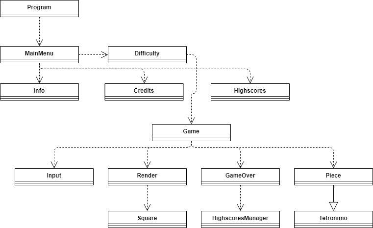

# Project Report for Programming Languages 2 - Tetris

## General Information

### Authors

* [Diogo Maia][DM], nº;
* [Tiago Alves][TA], nº a21701031;

### Meta

* [The Project's Statement][REF1];

* [The Course][LAMV];

* [The University][ULHT];

### Tasks Repartition

This project was made by a group of two and all the tasks were equally distributed by both of us. Some of the tasks were completed by either one member of the group or the other, while others were done by both of us together.

All of the tasks are documented under the form of "commits" on our [GitHub Repository][GH].

## Proposed Solution

### Project's Classes

#### Program.cs

* Starts the program;

* Calls Display() method of MainMenu.cs;

#### MainMenu.cs

* Displays the menu;

* Calls Display() methods of Difficulty.cs, Highscores.cs, Info.cs and Credits.cs;

#### Difficulty.cs

* Displays the difficulty menu;

* Calls Start() method of Game.cs;

#### Highscores.cs

* Displays the highscores;

* Calls Tuple GetScores();

#### Info.cs

* Displays info;

#### Credits.cs

* Displays credits;

#### Game.cs

*  Creates Start(), Gameloop(), CheckLine() and ClearLine();

* Start() calls Gameloop() and Display() of GameOver.cs;

* Gameloop() is a loop that calls Readkey() of Input.cs, updater methods of its own class such as Checkline() and Draw(), DrawBorder() and DrawScoreAndLevel() of Render.cs;

#### GameOver.cs

* Displays Game over and creates Retry();

* Calls AddScore() and Save() of HighscoresManager.cs, calls retry, which calls Display() of Difficulty.cs and MainMenu.cs;

#### HighscoresManager.cs

* Creates the file HighScores.txt;

* Creates HighscoresManager() constructor;

* Creates AddScore(), Save(), Tuple GetScores() and SortList();

#### Input.cs

* Reads input;

* Creates Readkey();

#### Render.cs

* Draws game;

* Creates Draw(), DrawBorder(), DrawScoreAndLevel(), DrawNewTetromino() and ClearOldTetromino();

#### Square.cs

* Creates Square() constructor;

#### Tetromino.cs

* Creates Tetromino() constructor;

#### Piece.cs

* Inherits from Tetromino.cs;

* Creates PositionUpdate(), Spawn(), Drop(), Rotate(), TransformMatrix(), IsSomethingBelow(), nullable IsOverlayBelow(), IsSomethingLeft(), nullable IsOverlayLeft(), IsSomethingRight(), nullable IsOverlayRight();

### Project's Flow Chart

### Project's UML Diagram

## Conclusions

This project allowed us to consolidate what was taught in class during this semester and to learn new things by ourselves, which culminated in a great Tetris clone.

## References

* The C# Player's Guide - RB Whitaker (Starbound Software);

* C# 7.0 in a Nutshell: The Definitive Reference -  Joseph Albahari and Ben Albahari;

* https://docs.microsoft.com/en-us/dotnet/csharp/

* https://docs.microsoft.com/en-us/dotnet/csharp/programming-guide/

* https://www.dreamincode.net/forums/topic/215620-a-basic-c%23-console-game-movement-engine/

* https://github.com/NikolayIT/CSharpConsoleGames/tree/master/Tetris

* https://codereview.stackexchange.com/questions/127515/first-c-program-snake-game

* https://www.c-sharpcorner.com/UploadFile/75a48f/tic-tac-toe-game-in-C-Sharp/

* https://blog.naver.com/spica1028/220329924713

* https://code.msdn.microsoft.com/windowsdesktop/TetrisNet-800ccbd9

* http://www.macoratti.net/16/02/c_tetris1.htm

* https://github.com/BobNobrain/c-sharp-tetris

* http://netcode.ru/dotnet/?artID=6778

* https://www.dotnetperls.com/nullable-bool

* https://docs.microsoft.com/en-us/dotnet/csharp/programming-guide/nullable-types/using-nullable-types

* https://stackoverflow.com/questions/2673918/best-way-to-check-for-nullable-bool-in-a-condition-expression-if

* http://gameprogrammingpatterns.com/design-patterns-revisited.html

* https://stackoverflow.com/questions/17440555/using-timer-and-game-loop

* https://github.com/VideojogosLusofona/lp2_exercicios

* https://github.com/VideojogosLusofona/lp2_2018_aulas

[DM]:https://github.com/IssaMaia
[TA]:https://github.com/synpse
[LAMV]:https://www.ulusofona.pt/licenciatura/aplicacoes-multimedia-e-videojogos
[ULHT]:https://www.ulusofona.pt/
[REF1]:https://github.com/VideojogosLusofona/lp2_2018_p2
[GH]:https://github.com/synpse/lp2p2
