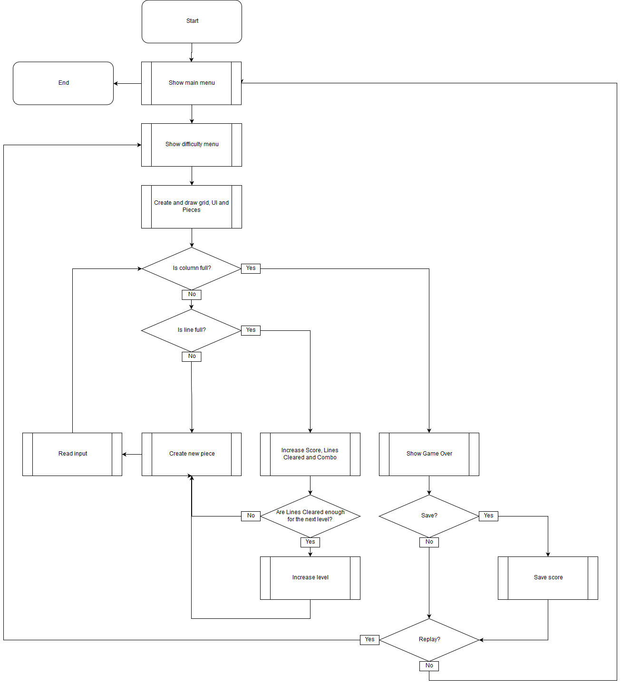

# Project Report for Programming Languages 2 - Tetris

## General Information

### Authors

* [Diogo Maia][DM], nº
* [Tiago Alves][TA], nº a21701031

### Other Information

* [The Project's Statement][REF1]

* [The Course][LAMV]

* [The University][ULHT]

### Tasks Repartition

This project was made by a group of two, therefore all the tasks were equally distributed by both of us. Some of the tasks were completed by one of us alone, while others were done by both of us together.

All the tasks are documented under the form of "commits" on our [GitHub Repository][GH].

## Proposed Solution

### Project's Flow Chart

### Project's UML Diagram

## Conclusions

This project allowed us to consolidate what was taught in class during this semester and to learn new things by ourselves, which culminated in a great Tetris clone.

## References

[DM]:https://github.com/IssaMaia
[TA]:https://github.com/synpse
[LAMV]:https://www.ulusofona.pt/licenciatura/aplicacoes-multimedia-e-videojogos
[ULHT]:https://www.ulusofona.pt/
[REF1]:https://github.com/VideojogosLusofona/lp22018p2
[RP]:https://github.com/synpse/lp2p2
